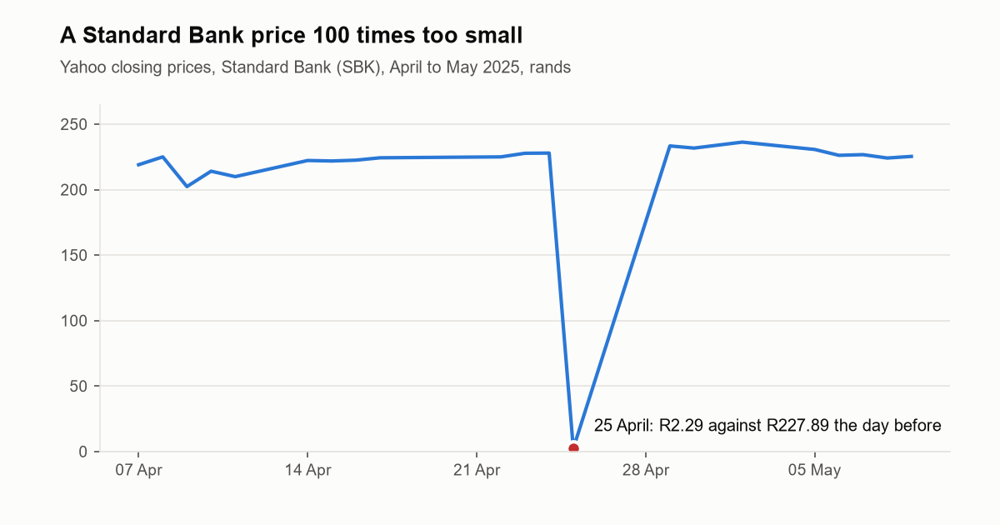
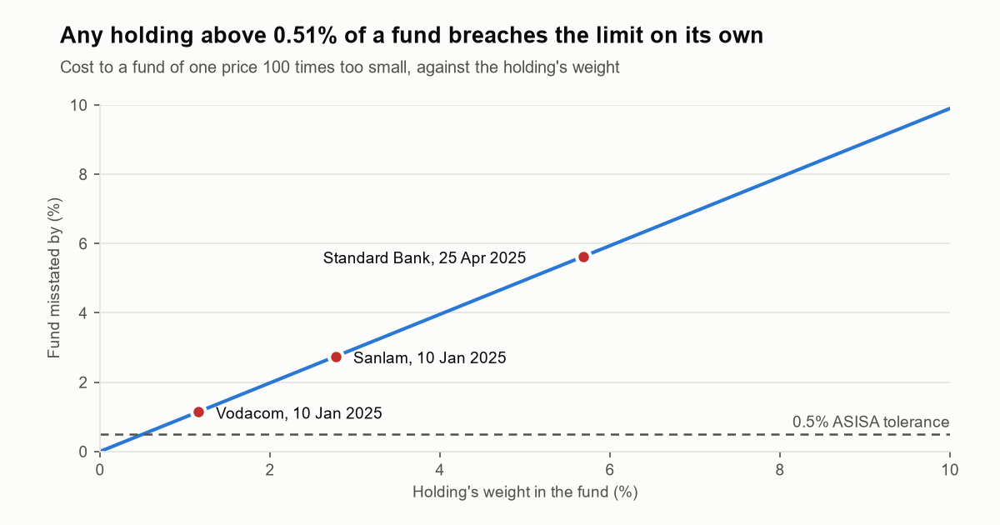
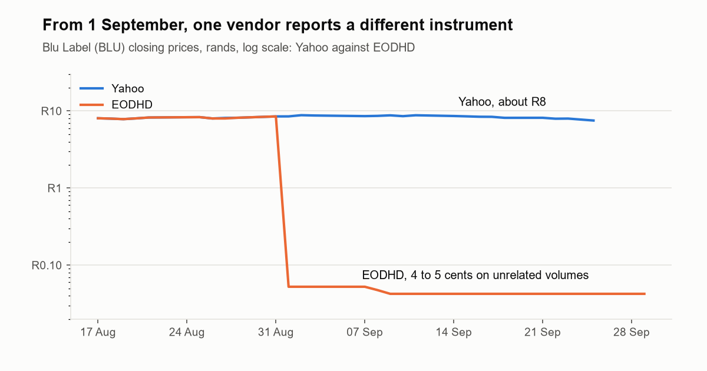

# JSE Share Price Reconciliation

**Can a free source of share prices be trusted to value an investment fund?**

Fund administrators work out what every fund is worth each day from share prices supplied by data
vendors. If one of those prices is wrong, the fund's value is wrong, and investors who buy or sell
that day pay or receive the wrong amount. Administrators guard against this with
**reconciliation**: checking prices against independent records and investigating every
difference.

Free sources such as Yahoo Finance are widely used for research and personal investing, but they
come with no guarantee. I wanted to know whether one could be trusted to value a fund of JSE shares,
so I did the job of a fund administrator's pricing analyst: I built the daily price controls and
pointed them at five years of Yahoo's prices for 107 JSE shares. (Real administrators buy licensed
feeds such as Bloomberg, Refinitiv or the JSE's own; the controls are the same.)

## What I found



**1. Some prices were 100 times too small.** On 10 January 2025, Yahoo recorded seven JSE shares,
including Vodacom and Sanlam, at one hundredth of their real price for a single day. It happened
again on 25 April 2025, to Standard Bank and two others. A price at one hundredth understates a fund
by 99% of that holding's weight, so **any holding above 0.51% of a fund breaches, on its own, the
0.5% limit** that South Africa's fund industry sets for how far out a fund's price can be before the
error must be put right. For a fund holding the Top 40 at its published weights, Standard Bank's bad
price alone would have understated it by **5.63% on 25 April, 11 times the limit**; 10 January would
have cost 5.35%. Any administrator's day-on-day check catches a 99% overnight fall, and this tool's
checks caught all ten, with no correct price flagged among the 131,627. The finding is that this feed
cannot value a fund without those controls.



**2. A whole trading day was published late, on the worst possible day.** Yahoo's prices for
Monday 28 September 2026 did not appear until more than 17 hours after the market closed. When a
price is missing, the industry standard allows the most recent one, here Friday's, but only after
checking it is fair and reasonable. That Monday it was not: gold miners sold off, and Gold Fields fell
12% on three times its usual volume. Used unchecked, Friday's prices would have overstated an
equal-weighted fund of the 107 shares by **0.61%**, above the 0.5% limit; the figure for a Top 40
fund, where Gold Fields alone is 8.6%, follows once the 30 September snapshot is stored. Whether a
delay like this matters depends on when the fund is valued and must publish. I could tell it was a
vendor gap, not a market holiday, because the tool checks dates against its own JSE calendar, built
from South Africa's public holiday law.

**3. Past prices were not rewritten, in the one comparison so far.** Two fetches of the same three
months, four hours apart on 29 September, agreed on every one of 6,678 closing prices to the cent;
the only differences were the late day above. One comparison is thin evidence, so the check now runs
on every new snapshot.

**4. The list of securities goes out of date.** Five of the 112 codes on file had been renamed or delisted,
four of them since March 2025, including Transaction Capital becoming Nutun. Yahoo had quietly moved
Transaction Capital's entire price history under the new code, which would break any comparison
with a source that kept the old one.

**5. Some prices sat frozen.** On 20 occasions a share's price stayed identical for five or more
trading days. The longest was Fortress Real Estate, unchanged for 28 sessions in 2022. A frozen
price can mean a trading suspension or a dead feed, and each needs a person to check which.

**6. The commercial vendor made mistakes too.** Checking Yahoo against EODHD, a commercial data
vendor, on 18 shares: on 27 August 2026 EODHD repeated the previous day's closing price for 8 of them,
while reporting the correct trading volume for that day. And from 1 September, EODHD's prices for Blu
Label (BLU) were 99% below Yahoo's. I investigated: EODHD's volumes stopped matching the JSE share's that
day, its price moved between 4 and 5 cents, and it even reported trading on Heritage Day, when the JSE
was closed. EODHD had started reporting a different instrument under the code. Each break is recorded
with its evidence and a resolution; each source fails in its own way, which is exactly why a fund checks
one against another.



**7. Big moves need a person to check them.** A day-on-day movement check flags any share that moved
15% or more when the median share did not. Over five years it flagged 58 moves, about one a month,
the largest Super Group's 58% fall on 18 June 2025. Some will be company news and some corporate
actions; none is investigated yet. Yahoo's adjusted close did not adjust any of the 58, so the feed cannot tell a corporate action from
an error: each has to be checked against company announcements before the price is used.

## What this means

The fund industry's own pricing standard (from ASISA, the South African industry body) asks fund
managers to check prices by comparing several sources and by comparing each price with the one
before it. The tool runs both: a movement check and a 100x unit check on each source, and a daily
reconciliation between sources.

- A fund priced from this feed without controls would have gone past the 0.5% limit at least
  three times: twice from the 100x errors and once from the late day.
- The single-source checks catch errors too large to be real. Errors of a few percent look like
  normal price moves, and only a second, independent source can catch those. So after evaluating
  nine alternatives, I added a commercial data vendor (EODHD). Yahoo's prices are reconciled against
  it every day, 18 shares at a time, so every share is checked about once a week.
- A missing price is more dangerous than a wrong one, because the fallback hides it. Nothing looks
  wrong with a fund valued at Friday's prices; the only way to know is to check every expected day
  against an independent calendar.

## My recommendation

I wrote it up as a one-page memo to a Head of Valuations ([docs/memo.md](docs/memo.md)): never release a
fund's value from either vendor unchecked; compare every share against a second source every day, which the
free plan does not allow; and take each day's price from a fixed hierarchy (primary, then secondary, then the
previous close, verified), which the report's Approved Prices tab applies to every share. The memo sets out
each threshold with its evidence, the escalation rule, the cost, and what these controls cannot catch.

## The same control for holdings

The statement a fund gets from its broker has to agree with the fund's own records of what it
bought and sold, and with an independent valuation. I built that reconciliation too. With no real
brokerage export available, I generated a **synthetic** EasyEquities-style statement from real closing
prices and planted eight kinds of break in it, from a duplicated line to a trade that had not yet
settled. The tool finds all eight and raises no false alarms on the traps, such as a value 40 cents
out. The planted breaks and how they were made are in
[fixtures/holdings/README.md](fixtures/holdings/README.md).

This is a test of the control, not a finding about any real statement: the sizes of the planted
breaks set the numbers. It shows why a reconciliation must check every position: **netted, the
planted breaks leave the statement out by 0.88%; gross, by 16.95%**, because a duplicated line hides
most of a missing position. (A real fund reconciles against its custodian's statement; the retail
export stands in for one here.)

## How the tool found this

Every weekday a scheduled job saves each vendor's closing prices exactly as received, checks them
(unit errors, big unexplained moves, missing and closed days, frozen prices), reconciles them against the
previous day and the other vendor, tracks every break until it clears, and publishes an Excel break report
that is recalculated and checked against the database before release. The design and the reason for each
decision are in [docs/plan.md](docs/plan.md).

## The questions it answers every day

1. Are the prices right?
2. What would the errors have cost a fund?
3. Is every trading day there?
4. Does the vendor rewrite history, or publish late?
5. Is the list of securities still accurate?
6. Are any prices suspiciously frozen?
7. Do independent sources agree?
8. When sources disagree, does it get fixed, and how fast?
9. Does the broker statement agree with the fund's own records?
10. Which price should the fund use today, and why?

Each answer is worked out from the stored data, with the evidence behind it. The first two cover
every price stored, not only the latest day's download, so an old error never drops out of the
answer. `python -m src.answers` prints them, the daily job posts them in its run summary, and the
Excel report, attached to each run for 30 days, includes them.

The numbers of shares differ by what is counted: 112 codes are on file, 107 are requested each day
(the five retired codes are not), and the five-year history holds 106, because Nutun was added after
it was taken.

## Skills shown

| Area | What it involves here |
|---|---|
| SQL | Joins, window functions and views that do the matching and quality checks |
| Python | The data pipeline, vendor connection and reporting |
| Testing | A suite of planted errors the tool must find, built from real cases in the data |
| Automation | A scheduled GitHub Actions job that collects, checks, reconciles and reports daily |
| Finance | Fund valuation (NAV), reconciliation breaks, tolerances, renames and delistings |
| Data quality | Audit trails, tamper detection, and flagging problems rather than hiding them |
| Research | Comparing nine data vendors, and checking facts against primary sources where possible: JSE market notices, the ASISA pricing standard, government holiday declarations |

## Progress

- [x] Daily automated price collection with integrity checks
- [x] Company reference data, including renames and delistings
- [x] JSE trading calendar and data quality checks
- [x] Reconciliation engine, running daily on consecutive snapshots
- [x] An independent commercial price source, chosen from nine evaluated
- [x] Tracking each difference from first appearance until it is resolved
- [x] Excel report of breaks for an operations team, checked before it is published
- [x] Holdings reconciliation against a brokerage-style export (synthetic, with planted breaks)
- [x] Investigating the first real breaks between Yahoo and EODHD, and recording each resolution
- [ ] Writing up the results once EODHD has checked every share, in early October 2026

## Running it

Anyone can run the whole pipeline on **synthetic** data: twelve fictional shares, two fictional vendors and
every kind of error planted, from a 100x price to a vendor reporting the wrong instrument. Python 3.10 or
newer:

```bash
pip install -r requirements.txt
python -m src.demo
```

It prints the ten answers for each fictional vendor and writes the Excel break report to
[docs/sample/break_report_SYNTHETIC.xlsx](docs/sample/break_report_SYNTHETIC.xlsx). A test checks that every
planted error is found and every trap stays quiet, and each push runs the demo and recalculates its report in
LibreOffice. The tests run with `python -m unittest discover -s tests -t .`.

The real snapshots live in a private repository, because the price vendors' terms restrict republishing
their data; the daily job runs there too, calling this repository's workflow, so its logs and reports stay
private. With access to it, `git clone https://github.com/andre3oo0/jse-price-data.git data/landing`, then
`python -m src.rebuild`, `python -m src.recon`, `python -m src.answers` and `python -m src.report` rebuild
everything; `python -m src.charts` redraws the charts above.

## More detail

- [docs/memo.md](docs/memo.md) is the recommendation to a Head of Valuations
- [docs/findings.md](docs/findings.md) is a dated log of each finding, with the evidence
- [docs/sources.md](docs/sources.md) compares the nine price sources considered, and why EODHD was chosen
- [docs/plan.md](docs/plan.md) covers the design and the reasoning behind each decision
- [docs/easyequities_export.md](docs/easyequities_export.md) covers the brokerage export format
- [fixtures/holdings/README.md](fixtures/holdings/README.md) lists the breaks planted in the synthetic statement
